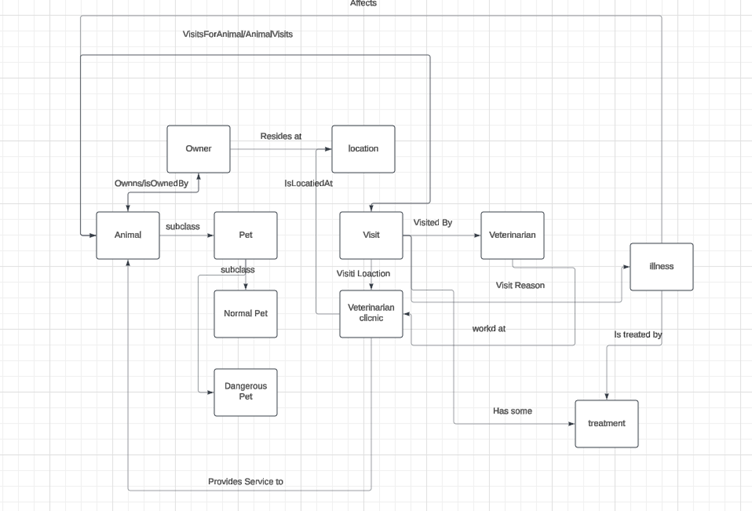

Veterinary Care Ontology
========================

**Design**
----------

The **Veterinary Care Ontology** is designed to support an intelligent system for veterinarians to keep track of pets, their owners, veterinary visits, treatments, and medical records.

The ontology operates in the **veterinary care domain**, which involves pets, their biological and medical information, their relationships with humans (e.g., owners, veterinarians), and their links to locations such as veterinary clinics.

### **Key Components**

-   **Animals**: Includes subclasses such as `NormalPets`, `DangerousPets`, and their further subclasses (e.g., `Dog`, `Rabbit`).
-   **Owners**: Represents individuals who own animals and are responsible for their care.
-   **Veterinary Professionals**: Provides information about veterinarians and their roles in treating animals.
-   **Visits**: Captures the relationship between an animal and its visits to a veterinarian.
-   **Treatments and Diseases**: Tracks medical interventions and conditions affecting animals.

* * * * *

**Literature Review**
---------------------

To establish the knowledge requirements for the ontology:

1.  **Veterinary Care Management Systems**: Research functionalities like scheduling, medical recordkeeping, and recommendation systems for treatments.
2.  **Relevant Ontologies**: Review established ontologies such as OBO (Open Biological and Biomedical Ontologies) or VetMed Ontology for concepts related to animal health and care.
3.  **Pet-Owner Relationship Models**: Study data models focusing on microchip-based identification and ownership management.

* * * * *

**Competency Questions**
------------------------

### **Pet Management**

1.  What are the details of a pet (name, microchip ID, age, weight) given its `AnimalId`?
2.  What pets are owned by a specific owner (Sacha)?.
3.  What pets belong to the NormalPets subclass??
4.  What ongoing veterinary visits exist for specific pets??
5.  What treatments have been applied for a specific disease??
6.  Can we add an animal to an owner? 

### **Owner and Pet Relationship**

1.  Who is the owner of a specific pet?
2.  What pets are owned by a person with a given name?

### **Veterinary Visits**

1.  What visits has a specific pet had?
2.  Does a pet currently have any ongoing visits?

* * * * *

**Knowledge Requirements**
--------------------------

### **1\. Pet Identification**

-   **Attributes**: `AnimalId`, `MicrochipId`, `animalName`, `age`, `weight`.
-   **Relationships**:
    -   `Owns` (links an owner to a pet).
    -   `ProvidesService` (links animals to veterinary clinics).
    -   `HasVisit` (links pets to veterinary visits).

### **2\. Owner Information**

-   **Attributes**: `OwnerName` (for identifying owners). , `Email`, `TelephoneNumber`
-   **Relationships**:
    -   Linked to pets.
    -   Linked to locations (e.g., home address).

### **3\. Veterinarian Information**

-   **Attributes**: `VetName`, `LicenseNumber`, `Specialization`, `YearsOfExperience`.
-   **Relationships**:
    -   Linked to veterinary clinics.
    -   Linked to visits they performed.

### **4\. Veterinary Clinic Information**

-   **Attributes**: `ClinicName`, `ClinicLocation`.
-   **Relationships**:
    -   Linked to animals that receive services.
    -   Linked to veterinarians working at the clinic.

### **5\. Veterinary Visit Data**

-   **Attributes**: `visitDate`, `isOngoing` (boolean indicator for ongoing visits).
-   **Relationships**:
    -   `isForAnimal` (links a visit to a specific pet).
    -   `VisitReason` (links to an illness).
    -   `VisitInvolvesTreatment` (links to a treatment).
    -   `VisitedBy` (links a visit to the veterinarian).
    -   `VisitLocation` (links a vist to a clinic).
    -   `VisitsForAnimal` ( links visit to animal).

* * * * *

**Evaluation**
--------------

### **Assessment of the Quality and Coverage**

The **Veterinary Care Ontology** has been evaluated using a structured process based on **competency questions** and their implementation through **SPARQL queries**. The following table summarizes the evaluation results:

| **Competency Question** | **SPARQL Query** | **Result** | **Outcome** |
| --- | --- | --- | --- |
| What pets are owned by a specific owner (`Sacha`)? | Query using `vc:OwnerName` and `vc:Owns`. | Correct pets retrieved. | Ontology sufficiently supports ownership relationships. |
| What are the details (name, microchip ID, age, weight) of a pet based on its ID? | Query filtering `vc:MicrochipId` and retrieving `vc:AnimalId`, `vc:Age`, etc. | Accurate details returned. | Pet attributes are correctly modeled and queried. |
| What pets belong to the `NormalPets` subclass? | Query with `rdfs:subClassOf vc:NormalPets`. | Correct pets retrieved. | Subclass relationships are modeled and inferred properly. |
| What ongoing veterinary visits exist for specific pets? | Query filtering `vc:isOngoing` and `vc:isForAnimal`. | Partial results received. | Missing relationships; refinement required for `isOngoing` as a data property. |
| What treatments have been applied for a specific disease? | Query using `vc:treatedBy` linking disease and treatment. | Incorrect results. Needs futher testing | Ontology doesn't fully support illness-treatment relationships. The relationship bewtween pet-visit-illness needs more testing |
| Can we add an animal to an owner? | SPARQL Update query to insert a new pet (`Boss`) and link it to an owner (`Sacha`). | Successfully inserted. | Ontology supports adding new animal instances and linking them to owners. |

* * * * *

**Considering LLM Research**
----------------------------

### Link to the Paper

[**Knowledge Graph Accuracy Evaluation: An LLM-Enhanced Embedding Approach**](https://link.springer.com/article/10.1007/s41060-024-00661-3)

This paper, titled "Knowledge graph accuracy evaluation: an LLM-enhanced embedding approach," proposes a novel method for evaluating the accuracy of knowledge graphs (KGs) using a combination of embedding models and Large Language Models (LLMs). 
First a representation of the Knowledge Graph in vector space is created using a embedding model ( usually TransE) .  This allows the embedding learn the current structure of the Knowledge Graph and estimate if a triplet (subject, predicate, object) is true or not based on it’s learned representation of the graph. 

Embedding models aren’t perfect, therefore the paper proposes utilizing a method called “questionable triplets”. Questionable triplets are triplets that either have embedding scores in the middle range which makes it hard to classify them as true or false or that don’t have enough connecting links between other entities.

To deal with the questionable triplets, the researchers propose transforming them into a natural language prompt to feed to the LLM. The LLM’s judgement is then utilized to refine the initial judgment made by the embedding model. 

While this paper is primarily aimed large scale already deployed Knowledge graphs, it could be useful while further developing my ontology or to assess what I currently have developed. One factor that I would have to consider is that the data I have available currently may not be enough to properly train an embedding model specific for my ontology, however I could still utilize key aspects of the paper. 

**Identify potential inaccuracies in my ontology:** using the questionable triplets selection process I could identify areas in my ontology that require further scrutiny. 

**LLM-Assisted Validation:** Use LLMs to verify the factual correctness of relationships in my ontology  translating triplets or statements from my ontology into natural language prompts and query an LLM to assess their validity. 

While utilizing the papers methods I should keep in mind that LLM’s tendency to hallucinate facts, so I should always keep a human in the loop approach. A very important factor when using LMM’s is the prompt that is used, a small difference in a prompt can generate vastly different outcomes, therefore I should take experiment with different prompt structures
